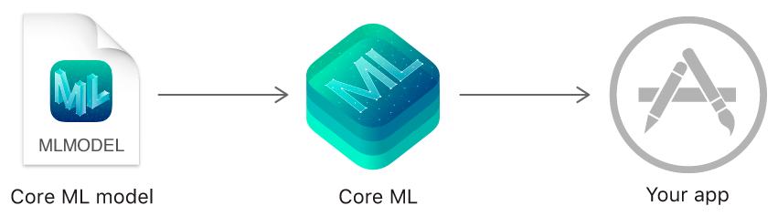
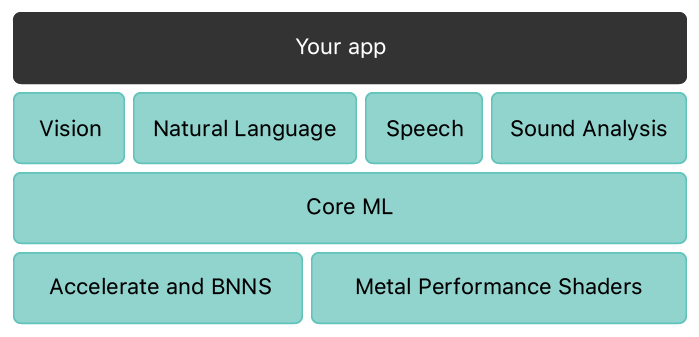

### Mini Project 3  
### The repo for the third mini project under EC601 - Product Design in ECE course at Boston University.   
## Mobile Machine Learning  
## Introduction
Mobile machine learning has come a long way in the last few years. These days, with the advent of powerful mobile hardware, it has become possible to develop mobile applications with powerful machine learning features like face recognition or text completion. There are two leading frameworks for this purpose, CoreML for Apple Devices, and MLKit for iOS and Android devices. Mobile ML presents unique challenges, like limited memory and power, and speed requirements. The algorithms need to be optimized for speed, as mobile use cases generally require instantaneous feedback, and the algorithms need to be power and compute efficient to be practical in these settings.
## CoreML  

 
CoreML is Apple's proprietary framework for embedded machine learning inference inside Apps on Apple devices like the iPhone, Apple Watch etc. Models can be developed using either the proprietary CreateML format from the XCode IDE or converted to this format from supported frameworks like PyTorch or Tensorflow. It is more mature of the two frameworks, and was released earlier. Core ML supports a variety of machine learning models, including neural networks, tree ensembles, support vector machines, and generalized linear models. Core ML requires the Core ML model format (models with a .mlmodel file extension).

Using Create ML and your own data, you can train custom models to perform tasks like recognizing images, extracting meaning from text, or finding relationships between numerical values. Models trained using Create ML are in the Core ML model format and are ready to use in your app.

Apple also provides several popular, open source models that are already in the Core ML model format, like FCRN-DepthPrediction Depth Estimation, MNIST Drawing Classification, Resnet50 Image Classification, YOLOv3 Object Detection etc. 
 

##  MLKit  
MLKit is Google's proprietary framework for embedded machine learning inference on Android and iOS devices. It uses a Firebase backend for model training. Inference can be done either locally or via the cloud. It has superseded Tensorflow lite, which was designed for use in low power devices, such as mobile phones, and is more feature rich than it.   

